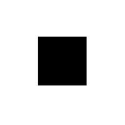

**YapAnimator** is your fast and friendly physics-based animation system. YapAnimator was built with ease-of-use in mind, keeping *you* sane and your designer very, *very* happy. All animations are interruptable, include completion blocks, and allow you to apply forces to them (e.g. adding the velocity from a gesture in a transition). We've included `Animatable` protocol conformance for some commonly animated types (`CG` types), but it's really easy to add conformance to any other type. **You can animate anything** that you can represent and compose with an array of `Double`s — view properties, music volume, morphing between bezier paths, colors, smoothing brush strokes, the list goes on… use your imagination!

[](https://travis-ci.org/yapstudios/YapAnimator)
[](https://img.shields.io/cocoapods/v/YapAnimator.svg)
[](http://cocoadocs.org/docsets/YapAnimator)

## Why use YapAnimator?

Because it's insanely easy to use and makes beautiful animations, that's why. There are other physics-based animation systems out there (e.g. UIKit's spring animations, Facebook's Pop), but they still require writing too much code, bookkeeping, and hand-holding for our taste. YapAnimator represents a distilled n-th iteration of code that we've been using in our own apps for years. We find it invaluable in our day-to-day and think that you will too.

## Built-in Extensions

YapAnimator comes with a handy extension bolted on to `CALayer` and `UIView`/`NSView`, providing one-liner animations under the `animatedLayer` and `animated` properties, respectively.


```swift
func handle(gesture: UIPanGestureRecognizer) {

	if gesture.state == .began {
		squircle.animated.cornerRadius.animate(to: squircle.bounds.width / 2.0)
		squircle.animated.rotationZ.animate(to: .pi)
	else if gesture.state == .changed {
		squircle.animated.position.instant(to: gesture.location(in: nil))
	} else if gesture.state == .ended {
		squircle.animated.position.animate(to: self.view.center)
		squircle.animated.cornerRadius.animate(to: 0)
		squircle.animated.rotationZ.animate(to: 0)
	}
}
```

## Custom Animators

Creating a custom animator is straightforward:

- `initialValue` This sets the initial value of the animator and informs it what type it will be animating.
- `willBegin` Called just before motion starts. Return the actual value of the property that you'll be animating. This allows the animator to sync up with that value in case it was changed outside of the scope of the animator. *(optional)*
- `eachFrame` Called each frame of the animation — this is typically where you'd apply the animator's `current.value` to the property that you're animating. You can also use it to check values to trigger other actions / animations.

```swift
frameAnimator = YapAnimator(initialValue: square.frame, willBegin: { [unowned self] in
	return self.square.frame
}, eachFrame: { [unowned self] (animator) in
	self.square.frame = animator.current.value
})
```



```swift
frameAnimator.bounciness = 1.5

frameAnimator.animate(to: square.frame.insetBy(dx: -50, dy: -50), completion: { animator, wasInterrupted in
	if !wasInterrupted {
		// animate back to the original value
		animator.animate(to: animator.current.value.insetBy(dx: 50, dy: 50))
	}
})
```

## Questions?

Feel free to [ask your question in an issue](https://github.com/yapstudios/YapAnimator/issues/new). We will respond there, and  amend this read me/start a wiki if the answer seems like it would benefit others.

## Credits

YapAnimator is owned and maintained by [Yap Studios](http://www.yapstudios.com).
